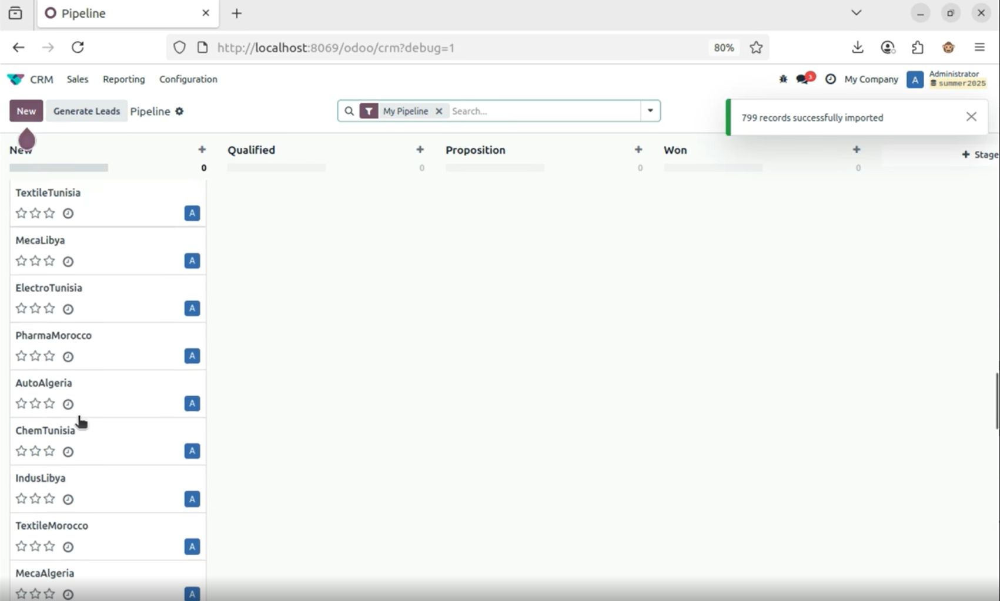

<div align="center">

# 🔗 LinkedIn → Odoo CRM Integration

**Scraping 800+ LinkedIn company leads and injecting them into a custom Odoo CRM module**

[](https://www.python.org/)
[](https://www.selenium.dev/)
[](https://www.crummy.com/software/BeautifulSoup/)
[](https://www.odoo.com/)
[](https://jupyter.org/)

[Overview](#-overview) · [Features](#-features) · [Architecture](#️-workflow) · [Getting Started](#-getting-started) · [Custom Module](#-odoo-custom-module)

</div>

---

## 📌 Overview

An end-to-end pipeline that bridges **LinkedIn lead scraping** with **Odoo CRM customization**. The project automates the collection of company leads at scale and streamlines their import into a production-ready CRM system.

> 🏆 **800+ company leads** scraped, enriched, and pushed into Odoo CRM — fully automated.

---

## ✨ Features

- 🕷️ **LinkedIn Scraping** — Automated extraction of company leads using Selenium & BeautifulSoup4
- 🗂️ **Structured Data** — Leads exported in a clean, CRM-ready format
- 🧩 **Custom Odoo Module** — Extended the native CRM with two new fields: `LinkedIn URL` and `Sector`
- 📥 **Seamless Integration** — Scraped data imported directly as CRM records in Odoo
- 🏭 **Industry Tracking** — Sector field enables filtering and segmentation by industry
- 🔗 **Source Tracing** — LinkedIn URL field preserves the origin of every lead

---


<div align="center">
  
  <br/>
  <sub><i>Custom Odoo CRM module with LinkedIn URL and Sector fields</i></sub>
</div>

---

## 🏗️ Workflow

```
LinkedIn Pages
      │
      ▼
 Selenium (browser automation)
      │  navigate & scroll
      ▼
 BeautifulSoup4 (HTML parsing)
      │  extract company data
      ▼
 Structured Dataset (CSV / JSON)
      │  800+ leads
      ▼
 Custom Odoo CRM Module
      │  linkedin_url + sector fields
      ▼
 Odoo CRM Records ✅
```

---

## 📁 Repository Structure

```
linkedin-odoo-crm-integration/
├── linkedin_profile_scraping.ipynb   # Scraping pipeline (Selenium + BS4)
├── custom_crm_leads/                 # Odoo custom CRM module
│   ├── __init__.py
│   ├── __manifest__.py
│   ├── models/                       # Extended CRM lead model
│   └── views/                        # Updated form & list views
└── README.md
```

---

## 🚀 Getting Started

### Prerequisites

- Python 3.10+
- Google Chrome + ChromeDriver
- Odoo 16 or 17 (Community or Enterprise)

### 1 — Install Dependencies

```bash
pip install selenium beautifulsoup4 pandas requests
```

### 2 — Run the Scraper

Open and run the Jupyter notebook:

```bash
jupyter notebook linkedin_profile_scraping.ipynb
```

The notebook will:
1. Launch a browser session via Selenium
2. Navigate and scrape LinkedIn company pages
3. Parse and clean the data with BeautifulSoup4
4. Export results to a structured file ready for Odoo import

### 3 — Install the Custom Odoo Module

Copy the module into your Odoo addons path:

```bash
cp -r custom_crm_leads/ /path/to/odoo/addons/
```

Then in Odoo:
1. Go to **Settings → Activate Developer Mode**
2. Go to **Apps → Update Apps List**
3. Search for `custom_crm_leads` and click **Install**

---

## 🧩 Odoo Custom Module

The `custom_crm_leads` module extends the native `crm.lead` model with two new fields:

| Field | Type | Purpose |
|---|---|---|
| `linkedin_url` | `Char` | Direct link to the company's LinkedIn page |
| `sector` | `Char` / `Selection` | Industry or sector of the lead |

These fields are visible in both the **Kanban** and **List** views of the CRM pipeline.

---

## 💡 Key Learnings

- Scraping dynamic JavaScript-rendered pages with **Selenium**
- Parsing and cleaning HTML at scale with **BeautifulSoup4**
- Extending Odoo models without modifying core code (**inheritance pattern**)
- Structuring scraped data for real-world **CRM integration**
- The value of **source tracking** and **industry segmentation** in sales pipelines

---

## 📄 License

This project is intended for academic and research purposes only.

---

<div align="center">
  <sub>Built with ☕ and Python — from raw LinkedIn HTML to structured CRM records</sub>
</div>
